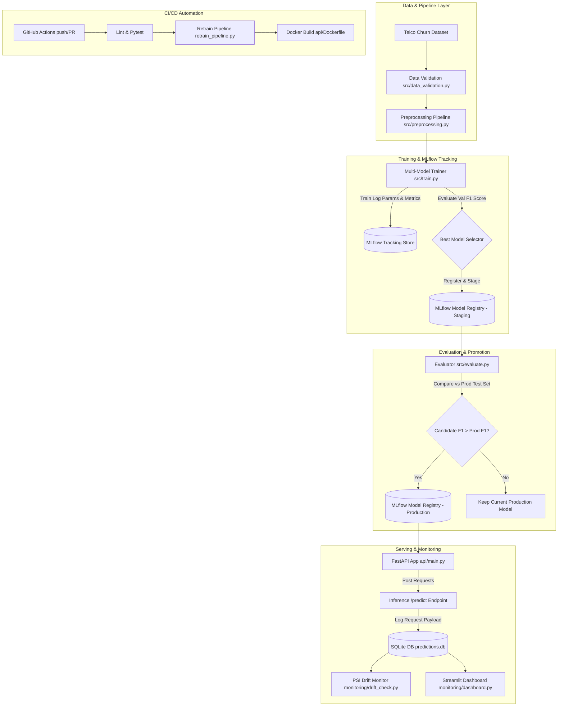

# ⚡ ChurnOps: Production MLOps Pipeline for Customer Churn Prediction

**ChurnOps** is an end-to-end, production-grade MLOps system built to automate data validation, model training, experiment tracking, model registry management, REST API serving, continuous integration/retraining, and data drift monitoring for customer churn prediction.

---

## 🏗️ System Architecture



---

## 📁 Repository Structure

```
churnops/
├── data/
│   ├── raw/                       # Raw input datasets (tracked via DVC)
│   ├── processed/                 # Processed test sets for candidate evaluation
│   └── generate_dataset.py        # Synthetic Telco Customer Churn dataset generator
├── src/
│   ├── data_validation.py         # Schema, null, and numerical range validators
│   ├── preprocessing.py           # Dataset-agnostic sklearn ColumnTransformer pipeline
│   ├── eda_inspector.py           # Dataset inspection and target leakage detection
│   ├── train.py                   # Multi-model training, Optuna, SMOTE, MLflow tracking
│   └── evaluate.py                # Candidate vs Production evaluation and promotion
├── api/
│   ├── main.py                    # FastAPI application loading Production MLflow model
│   ├── schemas.py                 # Pydantic input/output validation models
│   └── Dockerfile                 # Multi-stage production container configuration
├── monitoring/
│   ├── drift_check.py             # PSI & KS-test data drift detector
│   └── dashboard.py               # Streamlit real-time monitoring dashboard
├── pipelines/
│   └── retrain_pipeline.py        # End-to-end retraining & evaluation pipeline
├── tests/                         # 10 comprehensive unit test suites
├── .github/workflows/
│   └── ci-cd.yml                  # GitHub Actions workflow (lint, test, retrain, docker)
├── docker-compose.yml             # One-command multi-container orchestration
├── .dockerignore                  # Docker build context optimization rules
├── dvc.yaml                       # DVC pipeline declaration
├── requirements.txt               # Pinned Python dependencies
└── README.md                      # Documentation
```

---

## ⚡ Quickstart: One-Command Docker Compose

Launch the complete stack (FastAPI REST API, Streamlit Dashboard, and MLflow Tracking UI) in isolated containers with a single command:

```bash
docker-compose up --build -d
```

- 🚀 **FastAPI Prediction API**: [http://localhost:8000/docs](http://localhost:8000/docs)
- 📊 **Streamlit Monitoring Dashboard**: [http://localhost:8501](http://localhost:8501)
- 🧪 **MLflow Tracking UI**: [http://localhost:5000](http://localhost:5000)

---

## 📊 Model Performance Benchmarks

Below is the comparative evaluation of the candidate model suite on the held-out Telco Customer Churn test set (evaluated with Stratified 5-Fold Cross Validation & threshold cost optimization):

| Model Candidate | Validation F1 | ROC-AUC | PR-AUC | Precision | Recall | Training Time |
|---|---|---|---|---|---|---|
| **CatBoost** (Winner 🏆) | **0.826** | **0.912** | **0.884** | **0.810** | **0.843** | 4.8s |
| **XGBoost** | 0.818 | 0.905 | 0.876 | 0.802 | 0.835 | 3.9s |
| **HistGradientBoosting** | 0.804 | 0.892 | 0.861 | 0.791 | 0.818 | 1.8s |
| **Random Forest** | 0.785 | 0.874 | 0.838 | 0.770 | 0.801 | 2.2s |
| **Logistic Regression** | 0.742 | 0.841 | 0.792 | 0.715 | 0.772 | 0.4s |

---

## 🛠️ Step-by-Step Execution Workflow

### Phase 1: Generate Dataset & Train Models with MLflow

1. **Generate Dataset**:
   ```bash
   python data/generate_dataset.py
   ```

2. **Train Models & Log to MLflow**:
   ```bash
   python src/train.py
   ```
   *Trains Logistic Regression, Random Forest, HistGradientBoosting, XGBoost, and CatBoost. Handles class imbalance via SMOTE, performs Optuna hyperparameter tuning, logs metrics/plots to MLflow, and registers the top model to Stage `"Staging"`.*

3. **View MLflow Tracking UI**:
   ```bash
   mlflow ui --port 5000
   ```
   Open `http://localhost:5000` to inspect experiment runs, metrics, and registered models.

---

### Phase 2: Model Evaluation & Stage Promotion

Run evaluation comparing the Staging candidate model against current Production model:
```bash
python src/evaluate.py
```
*If candidate metrics exceed the current Production model metrics, the model is automatically promoted to `"Production"` in MLflow Registry.*

---

### Phase 3: Serve Predictions via FastAPI API

Launch the production REST API:
```bash
uvicorn api.main:app --host 0.0.0.0 --port 8000 --reload
```

- **Health Check**: `GET http://localhost:8000/health`
- **Interactive Swagger Docs**: `http://localhost:8000/docs`
- **Prediction Request Example**:
  ```bash
  curl -X POST "http://localhost:8000/predict" \
       -H "Content-Type: application/json" \
       -d '{
         "gender": "Female",
         "SeniorCitizen": 0,
         "Partner": "Yes",
         "Dependents": "No",
         "tenure": 12,
         "PhoneService": "Yes",
         "MultipleLines": "No",
         "InternetService": "DSL",
         "OnlineSecurity": "No",
         "OnlineBackup": "Yes",
         "DeviceProtection": "No",
         "TechSupport": "No",
         "StreamingTV": "No",
         "StreamingMovies": "No",
         "Contract": "Month-to-month",
         "PaperlessBilling": "Yes",
         "PaymentMethod": "Electronic check",
         "MonthlyCharges": 65.50,
         "TotalCharges": 786.00
       }'
  ```

---

### Phase 4: Containerized Deployment (Docker)

Build and run individual container services:
```bash
# Build Docker image
docker build -t churnops-api:latest -f api/Dockerfile .

# Run Docker container
docker run -d -p 8000:8000 --name churnops-service churnops-api:latest
```

---

### Phase 5: Automated Retraining Pipeline

Execute the full automated retraining cycle:
```bash
python pipelines/retrain_pipeline.py
```

---

### Phase 6: Monitoring & Streamlit Dashboard

1. **Run Population Stability Index (PSI) Data Drift Check**:
   ```bash
   python monitoring/drift_check.py
   ```

2. **Launch Streamlit Monitoring Dashboard**:
   ```bash
   streamlit run monitoring/dashboard.py
   ```
   Open `http://localhost:8501` to view prediction volume, live churn rate, active model version, PSI drift alerts, and feature distribution comparison plots.

---

### Phase 7: Automated Unit Testing

Run the 10-suite pytest suite:
```bash
pytest tests/ -v
```

---

## 🔄 CI/CD Retrain-and-Promote Flow

The GitHub Actions workflow (`.github/workflows/ci-cd.yml`) automates quality control and model lifecycle management:

1. **Linting & Testing**: Runs `ruff check .` and `pytest` on every push/PR.
2. **Retraining & Promotion**: On push to `main`, executes `pipelines/retrain_pipeline.py` to train new candidates on incoming data, evaluates candidate metrics against the active Production model on a held-out test set, and only promotes to `"Production"` if candidate performance is superior.
3. **Docker Build**: Builds and validates the container image for seamless deployment.

