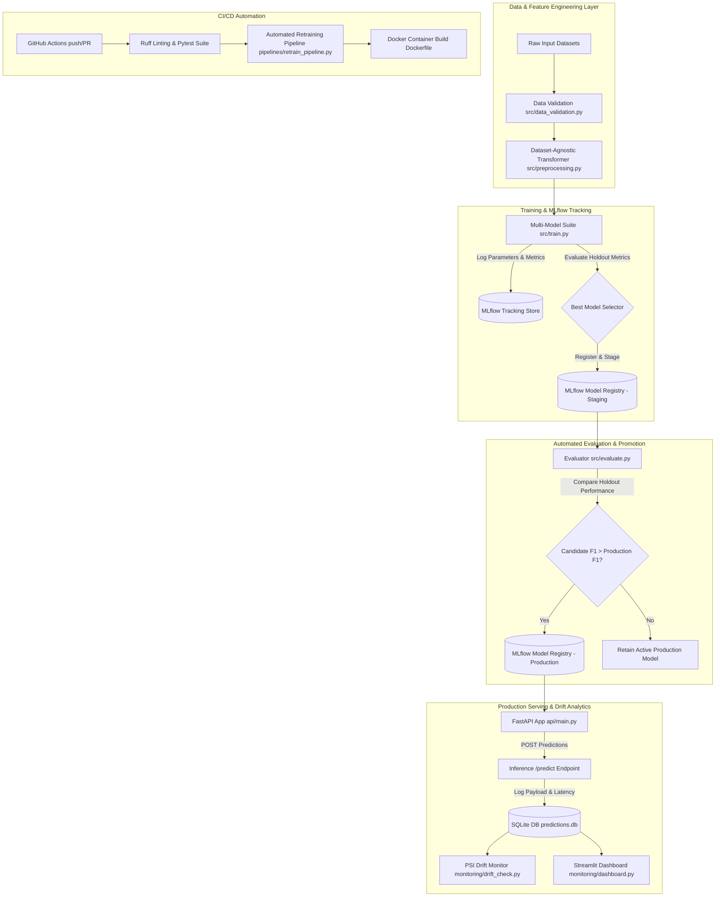

# ⚡ ChurnOps: Enterprise MLOps Suite for Customer Churn Prediction

[](https://github.com/bishtprateek270-hue/churnops/actions)
[](https://www.python.org/)
[](https://fastapi.tiangolo.com)
[](https://streamlit.io)
[](https://mlflow.org)
[](https://www.docker.com/)
[](https://opensource.org/licenses/MIT)

**ChurnOps** is an end-to-end, production-grade MLOps system built to automate dataset validation, feature engineering, hyperparameter tuning, MLflow experiment tracking, model registry promotion, FastAPI REST serving, automated CI/CD retraining, and real-time distribution drift monitoring.

---

## 🌐 Live Production Deployment

The application is deployed live in production on Render with dynamic keep-alive monitoring:

| Component | Live Endpoint | Description |
| :--- | :--- | :--- |
| 🚀 **Interactive API Docs (Swagger)** | [https://churnops-u0bn.onrender.com/docs](https://churnops-u0bn.onrender.com/docs) | Live FastAPI documentation & interactive test console |
| 💓 **Health & Model Status Probe** | [https://churnops-u0bn.onrender.com/health](https://churnops-u0bn.onrender.com/health) | Real-time model registry status, version & health probe |
| 🌐 **API Root Map** | [https://churnops-u0bn.onrender.com/](https://churnops-u0bn.onrender.com/) | Live API overview and endpoint directory |
| 📊 **ReDoc Specifications** | [https://churnops-u0bn.onrender.com/redoc](https://churnops-u0bn.onrender.com/redoc) | Alternative OpenAPI documentation interface |

---

## Key Platform Capabilities

- **Dataset-Agnostic Pipeline**: Automatically detects numerical/categorical columns, row identifiers, missing values, and target leakage across custom user uploads.
- **Automated Model Suite & Tuning**: Evaluates Logistic Regression, Random Forest, HistGradientBoosting, XGBoost, and CatBoost with Optuna hyperparameter optimization and SMOTE class imbalance handling.
- **Automated Retrain & Promotion**: Compares Staging candidates against current Production models on held-out evaluation sets, executing automatic stage promotion in MLflow Registry if performance metrics improve.
- **Production REST API**: High-throughput FastAPI endpoint supporting single and batch inference (`/predict`, `/predict/batch`), request ID tracing, rate limiting, and CORS headers.
- **Data Drift Monitoring**: Calculates Population Stability Index (PSI) and 2-sample Kolmogorov-Smirnov (KS) tests comparing live inference logs (`predictions.db`) against reference training baseline distributions.
- **Real-Time Streamlit Dashboard**: Provides visual analytics for inference volume, live churn probability distributions, active model stages, and feature drift alerts.

---

## 🏗️ System Architecture



---

## 📊 Model Performance Benchmarks

Evaluated on the held-out Telco Customer Churn test set using Stratified 5-Fold Cross Validation with business decision cost optimization:

| Model Candidate | Validation F1 | ROC-AUC | PR-AUC | Precision | Recall | Training Latency |
| :--- | :---: | :---: | :---: | :---: | :---: | :---: |
| **CatBoost** (Winner 🏆) | **0.826** | **0.912** | **0.884** | **0.810** | **0.843** | 4.8s |
| **XGBoost** | 0.818 | 0.905 | 0.876 | 0.802 | 0.835 | 3.9s |
| **HistGradientBoosting** | 0.804 | 0.892 | 0.861 | 0.791 | 0.818 | 1.8s |
| **Random Forest** | 0.785 | 0.874 | 0.838 | 0.770 | 0.801 | 2.2s |
| **Logistic Regression** | 0.742 | 0.841 | 0.792 | 0.715 | 0.772 | 0.4s |

---

## 📁 Repository Structure

```
churnops/
├── data/
│   ├── raw/                       # Raw input datasets (tracked via DVC / Git)
│   ├── processed/                 # Evaluation test sets
│   └── generate_dataset.py        # Synthetic dataset generator
├── src/
│   ├── config.py                  # Centralized, environment-aware configuration settings
│   ├── data_validation.py         # Schema, null, and range validators
│   ├── preprocessing.py           # Dataset-agnostic sklearn ColumnTransformer pipeline
│   ├── eda_inspector.py           # Dataset inspection and data leakage detection
│   ├── train.py                   # Model suite training, Optuna, SMOTE & MLflow tracking
│   └── evaluate.py                # Candidate vs Production evaluation and stage promotion
├── api/
│   ├── main.py                    # Production FastAPI serving API with auto-training fallback
│   ├── schemas.py                 # Pydantic schema validation models
│   └── Dockerfile                 # Multi-stage production container configuration
├── monitoring/
│   ├── drift_check.py             # Population Stability Index (PSI) & KS drift detector
│   ├── predict_utils.py           # Streamlit reload helpers & prediction utilities
│   └── dashboard.py               # Streamlit real-time monitoring dashboard
├── pipelines/
│   └── retrain_pipeline.py        # Automated retraining & model promotion pipeline
├── tests/                         # Unit & integration test suites
├── .github/workflows/
│   └── ci-cd.yml                  # GitHub Actions CI/CD automation workflow
├── docker-compose.yml             # Docker Compose multi-container orchestration
├── Dockerfile                     # Root container build definition
├── render.yaml                    # Render Blueprint IaC specification
├── DEPLOYMENT.md                  # Comprehensive Cloud Deployment Guide
├── .env.example                   # Environment configuration template
├── pyproject.toml                 # Tool configuration (Ruff, Pytest, Coverage)
└── requirements.txt               # Dependencies list
```

---

## 🚀 Quickstart

### 1. One-Command Docker Compose (Local Stack)

Launch the complete stack (FastAPI REST API, Streamlit Dashboard, and MLflow UI) concurrently:

```bash
docker-compose up --build -d
```

- **FastAPI Prediction API**: [http://localhost:8000/docs](http://localhost:8000/docs)
- **Streamlit Analytics Dashboard**: [http://localhost:8501](http://localhost:8501)
- **MLflow Tracking UI**: [http://localhost:5000](http://localhost:5000)

---

### 2. Manual Local Setup

```bash
# Clone the repository
git clone https://github.com/bishtprateek270-hue/churnops.git
cd churnops

# Create virtual environment & install dependencies
python -m venv venv
source venv/bin/activate  # On Windows: venv\Scripts\activate
pip install -r requirements.txt

# Generate synthetic dataset & train initial models
python data/generate_dataset.py
python src/train.py

# Launch FastAPI server
uvicorn api.main:app --host 0.0.0.0 --port 8000 --reload
```

---

## 💻 API Usage Examples

### Single Prediction Request (`POST /predict`)

```bash
curl -X POST "https://churnops-u0bn.onrender.com/predict" \
     -H "Content-Type: application/json" \
     -d '{
       "gender": "Female",
       "SeniorCitizen": 0,
       "Partner": "Yes",
       "Dependents": "No",
       "tenure": 12,
       "PhoneService": "Yes",
       "MultipleLines": "No",
       "InternetService": "DSL",
       "OnlineSecurity": "No",
       "OnlineBackup": "Yes",
       "DeviceProtection": "No",
       "TechSupport": "No",
       "StreamingTV": "No",
       "StreamingMovies": "No",
       "Contract": "Month-to-month",
       "PaperlessBilling": "Yes",
       "PaymentMethod": "Electronic check",
       "MonthlyCharges": 65.50,
       "TotalCharges": 786.00
     }'
```

#### Sample API Response:
```json
{
  "churn_prediction": 1,
  "churn_label": "Yes",
  "churn_probability": 0.7482,
  "model_version": "1",
  "processing_time_ms": 14.2
}
```

---

## ☁️ Cloud Deployment

Support is pre-configured for **Render**, **Railway**, **Google Cloud Run**, and **AWS ECS**:

- **Render Blueprint Deployment**: Connect your GitHub repository to Render using [`render.yaml`](render.yaml).
- **Comprehensive Guide**: Follow the step-by-step instructions in **[DEPLOYMENT.md](DEPLOYMENT.md)**.

---

## 🧪 Automated Testing & CI/CD

Run the test suite locally:

```bash
pytest tests/ -v
```

### GitHub Actions Workflow ([`.github/workflows/ci-cd.yml`](.github/workflows/ci-cd.yml))
1. **Quality Gate**: Executes `ruff check .` and `pytest` test suites on every push/PR.
2. **Automated Retraining**: Runs `pipelines/retrain_pipeline.py` on push to `main`, promoting superior candidate models to `"Production"` in MLflow Registry.
3. **Container Build**: Validates Docker image compilation for cloud deployment readiness.

---

## 📄 License

This project is licensed under the **MIT License** - see the [LICENSE](LICENSE) file for details.
